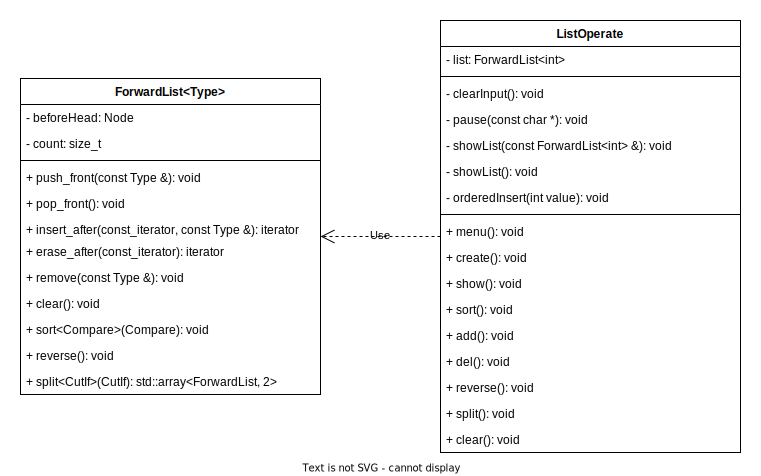

## C++ 单向链表操作

### 简介
- - - - - - - - - - - -

本项目是计科的一项实践作业，使用 C++ 语言开发，实现了**单向链表**数据结构及其基本操作。  
本项目的 [github 地址](https://github.com/I0me0I/forward-list-operate-cpp)

### 功能说明
- - - - - - - - - - - -


1. 创建链表  
输入多个正整数以创建链表，以 -1 结尾。每个正整数将被依次插入链表的头部，因此链表元素的次序将与输入的次序相反。此操作将清空之前已有的链表节点。

2. 显示链表元素  
按链表节点在链表中的次序显示元素。

3. 按升序排序  
将链表元素按从小到大的顺序排序。显示排序后的链表。

4. 添加链表元素  
将输入的正整数插入到链表第一个大于等于它的元素之前，无效的输入将被忽略。如果链表已经按升序排序，则执行插入操作后，链表依然是升序的。

5. 删除链表元素  
删除所有具有指定值的链表节点。

6. 反转链表  
将链表节点依次翻转。显示翻转后的链表。

7. 拆分奇数与偶数节点  
将链表拆分成分别具有原链表的所有奇数元素和偶数元素的两个链表。此操作将创建两个新的链表，不会修改原来的链表。返回时，新创建的链表将被销毁。

8. 清空链表  
删除链表所有节点，释放内存。

### 开发环境
- - - - - - - - - - - -

* MinGW-W64 8.1.0
* VSCode 1.82.2

### 项目内容
- - - - - - - - - - - -

#### 文件列表

该项目的文件列表如下：

    .vscode                  // vscode 配置文件
    |--c_cpp_properties.json
    |--launch.json
    |--settings.json
    |--tasks.json
    img                      // 图片
    |--listoper.png
    |--class.drawio
    |--class.svg
    forwardlist.h            // 包含 ForwardList 模板类的定义
    listoper.h               // 包含 ListOperate 类的声明
    listoper.cpp             // ListOperate 类的定义
    main.cpp                 // 主程序
    readme.md                // 本文档的 markdown 源文件
    报告.html                // 本文档的 html 版本
    报告.pdf                 // 本文档的 pdf 版本

其中`source`文件夹包含了本项目所有的 c++ 源文件。
如果安装了 g++ 编译器但没有 vscode，可以使用下面的命令编译并链接：

```shell
cd /path/to/project
g++ -g listoper.cpp main.cpp -o grademanager.exe -fexec-charset=GBK
```

项目报告使用 markdown 编写，为了便于老师阅读，已转换为 html 和 pdf 格式（即`报告.html`和`报告.pdf`），建议阅读 html 版本。  

#### 功能实现
该项目的类图：



`ForwardList`模板类实现了单向链表数据结构，包括插入、删除元素等功能，相当于简化版的`std::forward_list`。  
`ListOperate`类实现了单向链表的一些基础操作，并提供了文字用户界面。

### 使用示例

> 注意：如果本文档为 PDF 格式，下面的 GIF 图片无法正确显示

